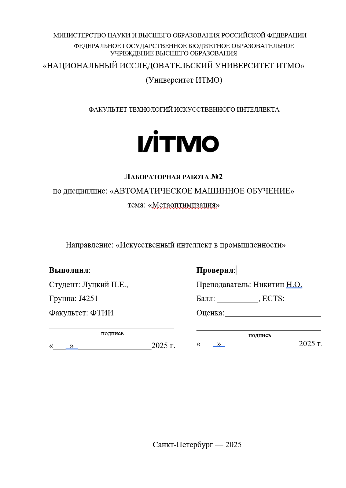

__Создание набора данных__

1.	Скачайте архив с наборами данных для задачи классификации или изучите API сайта OpenML.

- При необходимости сформулируйте набор критериев для фильтрации наборов данных и исключите неподходящие датасеты (например, слишком долгая обработка, низкое качество данных и т.д.). Минимальное количество наборов данных - 300.
2.	Реализуйте по несколько мета-признаков из каждой группы: базовые, статистический и структурные
-	Выберите один набор данных. Измените в нем порядок строк, столбцов и категорий при наличии категориальных признаков. Опишите, как изменились мета-признаки.

3.	Выберите не менее трех алгоритмов обучения с учителем и меру оценки алгоритма обучения (валидацию)
4.	Постройте мета-набор данных. Для каждого набора данных обучите каждый из выбранных ранее алгоритмов и определите наилучший.

- Если мета-набор данных получился сильно несбалансированным, попробуйте использовать другие алгоритмы или гиперпараметры алгоритмов обучения. Но не стоит настраивать гиперпараметры под каждый набор данных. В результате у вас должен получиться набор данных, где каждый пример - это датасет, его признаки это мета-признаки, а таргет - индекс лучшего алгоритма.

5.	Определите в мета-наборе данных попарную корреляцию мета-признаков. Если обнаружите пары с высокой корреляцией, объясните причины такого поведения и исключите лишние признаки в дальнейших шагах.

6.	Визуализируйте мета-набор данных проекцией на двумерном графике. Используйте разные цвета для разных мета-классов.
Сравнение поведения алгоритмов

7.	Протестируйте несколько алгоритмов обучения с учителем (включая наивный алгоритм) на полученном наборе данных. Алгоритмы обучения могут отличаться от используемых на 5-м шаге алгоритмов. Также можно использовать другие гиперпараметры для них.

8.	Для одного выбранного алгоритма проведите обучение для случаев с полным набором мета-признаков, а также для случаев в отсутствием признаков каждой из групп по отдельности (базовые, статистические, структурные). Сравните полученные метрики и объясните, подкрепив рассуждения графиками, полученные результаты.

9.	Выбрав один набор данных из мета-набора и любой из обученных ранее алгоритмов, добавьте в данные шум, измените метки целевого класса и категориальные признаки. Пересчитав метапризнаки, получите новое предсказание от алгоритма. Объясните изменение метапризнаков и новое предсказание.

__Требования и состав отчета__

1.	Отчёт должен быть выполнен в одном из вариантов (1) электронном документе с листами размером А4, созданным с использованием Microsoft Word, Libre Office и т.п., включающем ссылку на исходный код и данные, размещенные в репозитории (2) в формате jupyter notebook, включающем результаты всех экспериментов и анализ этих результатов.

2.	Отчёт должен начинаться с титульного листа с названием вуза и факультета, номером и названием лабораторной работы, вариантом, ФИО студента, No группы, датой выполнения.

3.	Отчет может включать список литературы со ссылками на источники, если для выполнения работы потребовалось обращаться к исследованиям.

4.	Отчет должен включать:
- Описание выбранного набора данных, методов обучения и пространства гиперпараметров
- Визуализацию процесса оптимизации при помощи optuna/hyperopt, AutoML, Random Search и анализ полученных графиков сходимости.
- Тот же набор графиков и результат оптимизации при другой целевой функции и сравнение результатов оптимизации для разных метрик, объяснение полученных результатов.
- Графики сходимости для случаев, описанных в п.6, сравнение с исходными запусками, обоснование различий в результатах работы алгоритмов оптимизации в различных пространствах поиска. Объяснение полученных результатов о значимости гиперпараметров.
